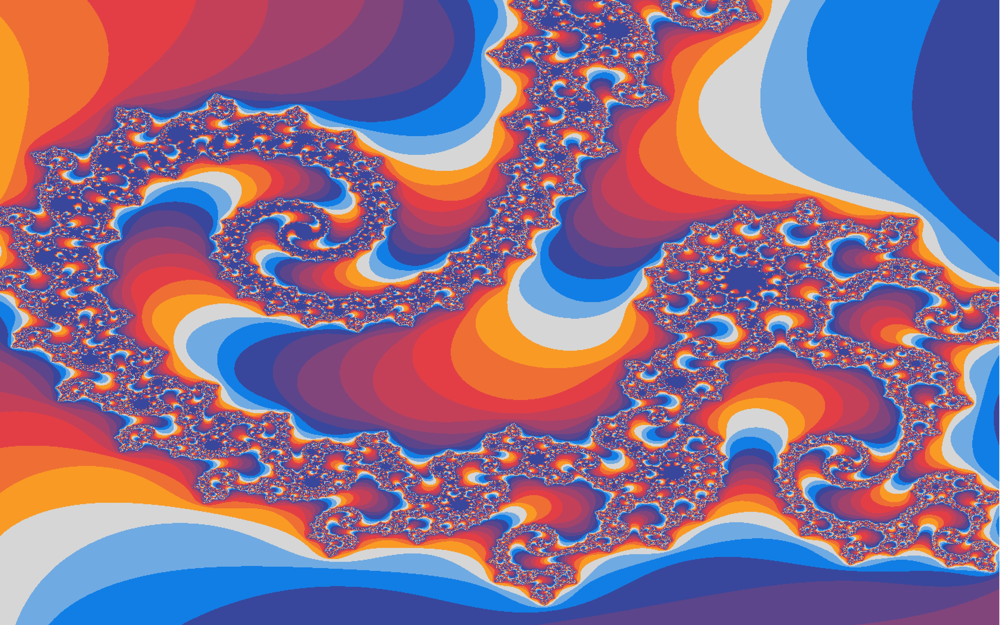

<!-- PROJECT LOGO -->
 

  <h3 align="center">PPM-Fractal</h3>

  

    An awesome CLI and GUI app to visualize fractals!
     
  

<!-- TABLE OF CONTENTS -->

  
Table of Contents

  <ol>
    <li>
      <a href="#about-the-project">About The Project</a>
      <ul>
        <li><a href="#built-with">Built With</a></li>
      </ul>
    </li>
  </ol>

<!-- ABOUT THE PROJECT -->

## About The Project

This CLI and GUI app allows users to create PPM images, apply image filters, and visualize fractals!

Project features:

- Multithreading
- Anti-aliasing

(<a href="#top">back to top</a>)

### Built With

- C++
- OpenGL

(<a href="#top">back to top</a>)

